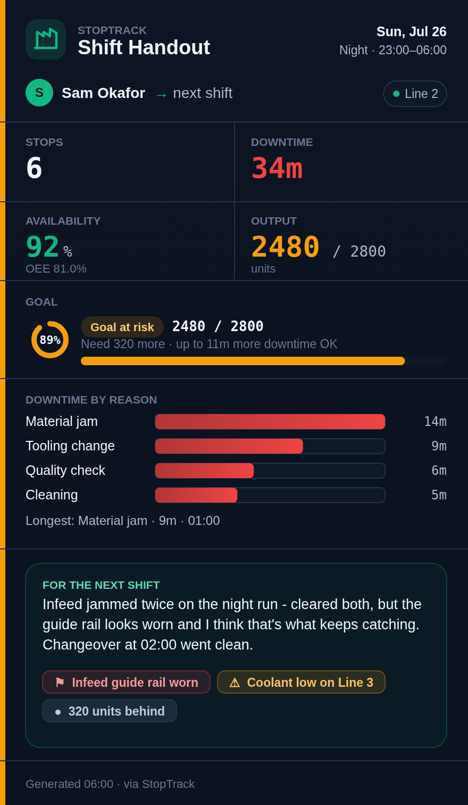

<div align="center">

# StopTrack

### Know exactly why your line stops — and what it costs you.

**Operators log every stop in one tap. Supervisors see the downtime, the OEE, and the money.
Works with no signal, no server, and no setup.**

[**Download for phone**](https://github.com/13242356com-lang/stoptrack/releases/latest) ·
[**Download for watch**](https://github.com/13242356com-lang/stoptrack/releases/latest) ·
[Install guide](android/INSTALL.md) · [Set up the server](server/SETUP.md)

</div>

---

## The problem

Machines stop all day. Somebody scribbles it on a clipboard, or nobody records it at
all — and at the end of the month there's no honest answer to *"where did the hours
go?"* Downtime you can't see is downtime you can't fix.

StopTrack makes logging a stop take **one tap**, so it actually gets done. Then it
turns those taps into the numbers that win arguments with the schedule.

## What you get

**For the operator — built for gloves and glare**
- **One-tap stop timer.** Start when the machine stops, End when it runs. Pick a reason from your list.
- **Log without opening the app** — a persistent notification and a floating button track the same timer, wherever you are on the floor.
- **Report a stop after the fact** if you were too busy to time it live.
- **Nothing is lost.** Close the app mid-stop, drop signal, refresh the page — your stop is still there.
- **On your wrist.** A Samsung / Wear OS watch app for hands-free timing.

**For the supervisor — the answers, not the raw data**
- **Live downtime, uptime and OEE** per machine, per shift, per operator.
- **Your worst reasons and worst machines**, ranked, over any date range.
- **Shift goals that warn you early** — StopTrack projects whether today's target is still reachable given the downtime so far.
- **Export to CSV or JSON** for anyone who wants it in a spreadsheet.

**The shift handout — the thing everybody forgets**
End of shift, one tap produces a single card with the whole shift on it — stops,
downtime, uptime, goal, top reasons — plus **the operator's own message and their own
flags** for whoever comes next. Share it straight to WhatsApp, Teams or email.

<div align="center">

</div>

## Get started

**Just want to try it?** Open [`index.html`](index.html) in Chrome on your phone. That's
the whole app — no install, no account, no server. Add it to your home screen and it
behaves like any other app.

**On the shop floor:** install the phone app from
[Releases](https://github.com/13242356com-lang/stoptrack/releases/latest) — it adds the
persistent notification, the floating quick-stop button and the watch link.
[Step-by-step install guide →](android/INSTALL.md)

**Then make it yours:** open **Supervisor → Settings** and set your machines, your stop
reasons, your shifts and your output targets. Nothing is hard-coded to any particular
factory.

## How it works

StopTrack is **offline-first**. Every stop is saved on the device the moment it's
logged — the network is never in the way of an operator doing their job.

Out of the box each device keeps its own data. When you want everyone on one shared
picture, run the optional **sync server** on any PC that stays on: phones and watches
push their stops to it, and the supervisor can open the same live view from anywhere.
[Plain-English server setup →](server/SETUP.md)

Have a PLC? The optional **gateway** can capture stops straight from the machine, so
short stops get recorded whether or not anyone taps a button.

## Questions

**Does it need internet?** No. It needs a connection the first time you open the web
version (to fetch its libraries) and then works offline. The installed phone app
doesn't need it at all.

**Where does my data live?** On your devices, and on your server if you run one. There
is no StopTrack cloud and nothing is sent anywhere you didn't configure.

**Will I lose my history when I update?** Take a backup first — **Supervisor → Settings
→ Backup & Restore** exports everything to one file you can restore afterwards. If you
run the server, your history lives there and updates change nothing.

**Is the uptime number exact?** It's an honest estimate based on the shift length you
configure, not a sensor reading. It's for spotting trends and making the case, not for
billing.

**How much does it cost?** Nothing. It's a private project, not a product with a sales team.

---

<details>
<summary><b>For developers</b></summary>

<br>

The app ships as one self-contained `index.html`, built from a single React source
file. No bundler, no runtime dependencies, no build step for the end user.

| Path | What it is |
|------|-----------|
| `StopTrack.tsx` | **The editable source** (React + JSX). Edit this. |
| `index.html` | **The built app** — the single file operators open. Generated; never hand-edited. |
| `build/` | The committed build: `build.mjs` + static scaffold (`head.html`, `icons.js`, `tail.html`). |
| `test/` | Headless-browser end-to-end tests (Playwright) that drive the real `index.html`. |
| `server/` | Optional sync backend (zero-dependency Node) so devices share one data set. |
| `gateway/` | Optional PLC gateway (Python) — simulator, S7 and OPC UA adapters. |
| `android/` | The phone app + Wear OS watch app (Kotlin). See [`android/README.md`](android/README.md). |

```bash
npm ci          # once — installs the pinned TypeScript + test deps
npm run build   # StopTrack.tsx -> index.html (+ dist/index.html)
npm test        # build, then run the browser end-to-end tests
```

`build/build.mjs` transpiles JSX to plain `React.createElement`, wraps it in the HTML
shell, and gates on no leftover JSX and no raw `??`/`?.`. Output is deterministic for
the pinned TypeScript version, so `index.html` is byte-stable.

**CI:** every push builds the app and runs the browser tests
([`web-test.yml`](.github/workflows/web-test.yml)), boots the phone app on an emulator
([`android-emulator.yml`](.github/workflows/android-emulator.yml)), builds both APKs
([`android.yml`](.github/workflows/android.yml)), and runs the gateway test suite
([`ci.yml`](.github/workflows/ci.yml)).

**Hosting the web app privately** (Cloudflare Pages + Access) is covered in
[`DEPLOY.md`](DEPLOY.md); the sync server can also serve the app itself at `/`.

**Secrets** never live in the repo. The sync server's token and any SMTP credentials are
environment variables on the server host; runtime data is gitignored.

Architecture, data model, and the constraints that keep this thing simple are documented
in [`CLAUDE.md`](CLAUDE.md). Security posture is in [`SECURITY.md`](SECURITY.md).

</details>
